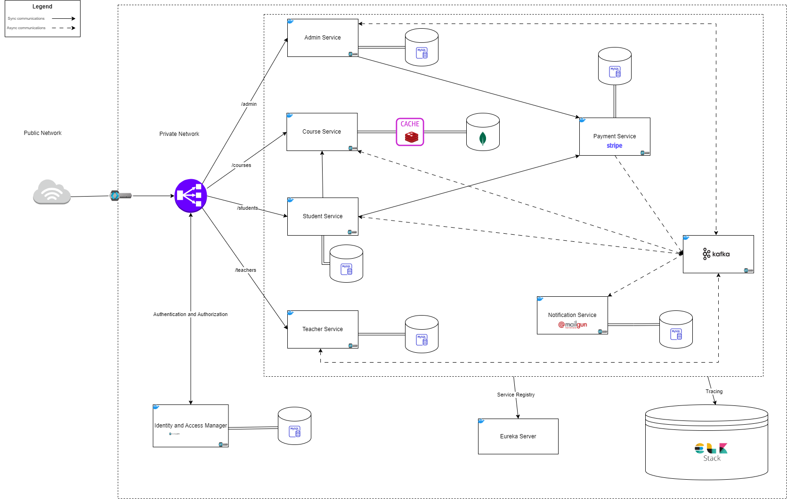

# Smart Academy Api

[](http://www.apache.org/licenses/LICENSE-2.0.html)

REST API built on [Spring Boot 3.2.2](http://projects.spring.io/spring-boot/).

## Requirements

For building and running the application you need:

- [JDK 17](https://www.oracle.com/java/technologies/downloads/#java17)
- [Maven 3.9.6](https://maven.apache.org)

## Running the application locally

There are several ways to run a Spring Boot application on your local machine:

- One way is to execute the `main` method of every module from your IDE.

- Alternatively you can use
  the [Spring Boot Maven plugin](https://docs.spring.io/spring-boot/docs/current/reference/html/build-tool-plugins-maven-plugin.html)
  like so:

    ```shell
      mvn clean install spring-boot:run
    ```

## Running the application on Docker

To run the application on docker, follow these steps:

1. Download Docker Desktop
   on [Windows](https://docs.docker.com/desktop/install/windows-install/), [MAC](https://docs.docker.com/desktop/install/mac-install/)
   or [Linux](https://docs.docker.com/desktop/install/linux-install/)
2. Install [Docker Compose](https://docs.docker.com/compose/install/)
3. Go to project directory
4. Run this command from each module directory.
   > Replace`[module-name]` by the module artifact and `[version]` by the corresponding version
     ```shell
      docker build -t [module-name]:[version]
     ```
5. Then, run this command from project directory
     ```shell
     docker-compose up
     ```

## Application Architecture



## Copyright

Released under the Apache License 2.0. See
the [LICENSE](https://github.com/codecentric/springboot-sample-app/blob/master/LICENSE) file.
